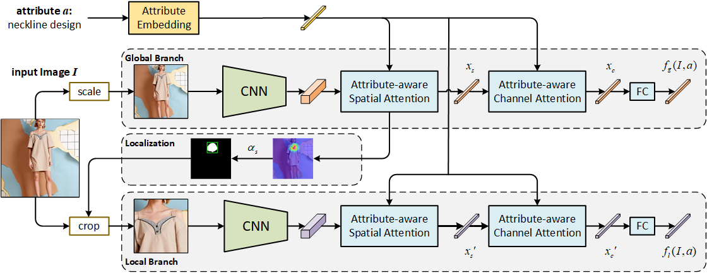

# Fine-Grained Fashion Similarity Prediction by Attribute-Specific Embedding Learning (ASEN++)

This repository is a [PyTorch](https://pytorch.org/) implementation for the paper **Fine-Grained Fashion Similarity Prediction by Attribute-Specific Embedding Learning**. This work extends our [previous work](https://ojs.aaai.org/index.php/AAAI/article/view/6845/6699) at AAAI 2020.




## Table of Contents

- [Environments](#environments)
- [Datasets](#datasets)
     - [Data Split](#data-split)
     - [Layout](#layout)
     - [Download Data](#download-data)
          - [FashionAI](#fashionai)
          - [DARN](#darn)
          - [DeepFashion](DeepFashion)
   - [Configuration](#configuration)

- [Training](#training)
- [Evaluation](#evaluation)
- [References](#references)

## Environments

- **Ubuntu** 16.04
- **CUDA** 10.1
- **Python** 3.6

Install other required packages by

```sh
pip install -r requirements.txt
```

## Datasets

### Data Split

To perform attribute-specific fashion retrieval, some index files ([data.zip(11M)](https://drive.google.com/file/d/1KUkwqdZxjmDL-ixCcIX8GbsnUFqqcpJH/view?usp=sharing)) are needed. It contains split annotations and meta data for three datasets, i.e., FashionAI, DARN, DeepFashion. Related files for each is included in a directory. Uncompress it by

```sh
unzip data.zip
```

### Layout

After unzip the `data.zip`, a directory rooted as `data` is created and has a layout as following:

```sh
data
├── FashionAI
│   ├── candidate_test.txt
│   ├── candidate_valid.txt
│   ├── filenames_test.txt
│   ├── filenames_train.txt
│   ├── filenames_valid.txt
│   ├── label_train.txt
│   ├── query_test.txt
│   └── query_valid.txt
├── DARN
│   └── ...
├── DeepFashion
│   └── ...
└── meta.json
```

### Download Data

#### FashionAI

As the full FashionAI has not been publicly released, we utilize its early version for the [FashionAI Global Challenge 2018](https://tianchi.aliyun.com/competition/entrance/231671/introduction?spm=5176.12281949.1003.9.493e3eafCXLQGm). You can first sign up and download two training subsets:

- **fashionAI_attributes_train1.zip(6G)**
- **fashionAI_attributes_train2.zip(7G)**. 

Once done, you should uncompress and link then into the `data/FashionAI` directory.

#### DARN

As some images’ URLs have been broken, only 214,619 images are obtained for our experiments. We provide with a series of [URLs](https://drive.google.com/file/d/10jpHsFI2njzEGl7kdACXbvstz6tXyE0R/view?usp=sharing) for the images. **Be sure** to download them into a `pic` directory that should be created in `data/DARN` directory.

#### DeepFashion

[DeepFashion](https://www.cv-foundation.org/openaccess/content_cvpr_2016/papers/Liu_DeepFashion_Powering_Robust_CVPR_2016_paper.pdf) is a large dataset which consists of four benchmarks for various tasks in the field of clothing including [category and attribute prediction](http://mmlab.ie.cuhk.edu.hk/projects/DeepFashion.html) which we use for our experiments, in-shop clothes retrieval, fashion landmark detection and consumer-to-shop clothes retrieval. Download the images into a `img` directory that should be created in `data/DeepFashion` directory.

### Configuration

The behavior of our codes is controlled by configuration files under the `config` directory. 

```sh
config
|── FashionAI
|   ├── FashionAI.yaml
|   ├── s1.yaml
|   └── s2.yaml
├── DARN
│   ├── DARN.yaml
│   ├── s1.yaml
│   └── s2.yaml
└── DeepFashion
    ├── DeepFashion.yaml
    ├── s1.yaml
    └── s2.yaml
```

Each dataset is configured by two types of configuration files. One is `<Dataset>.yaml` that specifies basic dataset information such as path to the training data and annotation files. The other two set some training options as needed.

If the above `data` directory is placed at the same level with `main.py`, no changes are needed to the configuration files. Otherwise, be sure to correctly configure relevant path to the data according to your working environment.

## Training

ASEN is trained in a two-stage way. For the first stage, we need to train the global branch. Run the following script that uses default settings:

```python
python main.py --cfg config/<Dataset>/<Dataset>.yaml config/<Dataset>/s1.yaml
```

Based on the trained global branch, the second stages jointly train the whole ASEN:

```python
python main.py --cfg config/<Dataset>/<Dataset>.yaml config/<Dataset>/s2.yaml --resume runs/<Dataset>_s1/checkpoint.pth.tar
```

## Evaluation

Run the following script to test on the trained models:

```python
python main.py --cfg config/<Dataset>/<Dataset>.yaml config/<Dataset>/s2.yaml --resume runs/<Dataset>_s2/model_best.pth.tar --test TEST
```

For your convenience, we also provide our trained model weights ([pretrained_asen.zip](https://drive.google.com/file/d/1Enidw3PC5IjJTvHsoOikhiV3E5d-WT1z/view?usp=sharing)) on the above three datasets. Just replace the resumed checkpoint file and run a test.

## References

If it's of any help to your research, consider citing our work:

```latex
@inproceedings{dong2021fine,
  title={Fine-Grained Fashion Similarity Prediction by Attribute-Specific Embedding Learning},
  author={Dong, Jianfeng and Ma, Zhe and Mao, Xiaofeng and Yang, Xun and He, Yuan and Hong, Richang and Ji, Shouling},
  year = {2021}
}
```

```latex
@inproceedings{ma2020fine,
  title={Fine-Grained Fashion Similarity Learning by Attribute-Specific Embedding Network},
  author={Ma, Zhe and Dong, Jianfeng and Long, Zhongzi and Zhang, Yao and He, Yuan and Xue, Hui and Ji, Shouling},
  booktitle={Thirty-fourth AAAI Conference on Artificial Intelligence},
  year = {2020}
}
```